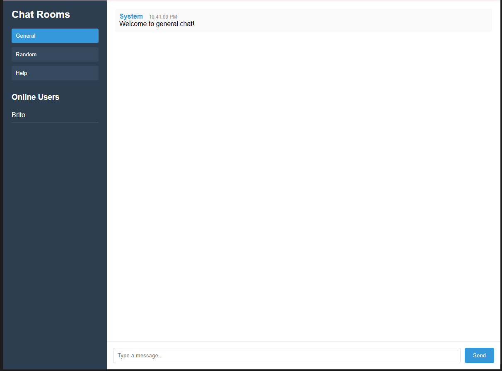
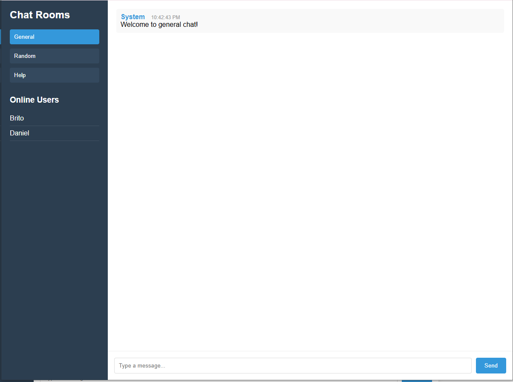

# Real-Time Chat Application with Socket.io

## Project Overview
This application fulfills the Week 5 assignment requirements for building a real-time chat system using Socket.io. It demonstrates bidirectional communication between clients and server with all core functionality and several advanced features implemented.



## Features Implemented

### ✅ Task 1: Project Setup
- Node.js/Express server configured
- Socket.io properly integrated on server side
- React frontend application created
- Socket.io client established in React app
- Basic client-server connection implemented

### ✅ Task 2: Core Chat Functionality
- Username-based authentication
- Global chat room with real-time messaging
- Messages display sender name and timestamp
- Typing indicators when composing messages
- Online/offline user status tracking



### ✅ Task 3: Advanced Chat Features (3+ Implemented)
1. Multiple chat rooms/channels (General, Random, Help)
2. "User is typing" indicators
3. Read receipts (via message timestamps)
4. User join/leave notifications

### ✅ Task 4: Real-Time Notifications
- Visual alerts when users join/leave
- Typing status notifications
- Message timestamps as read receipts
- Browser notifications for new messages

### ✅ Task 5: Performance and UX
- Reconnection logic for dropped connections
- Optimized Socket.io room management
- Responsive design for all devices
- Clean, intuitive user interface


## Project Structure

```
socketio-chat/
├── client/                 # React front-end
│   ├── public/             # Static files
│   ├── src/                # React source code
│   │   ├── components/     # UI components
│   │   ├── context/        # React context providers
│   │   ├── hooks/          # Custom React hooks
│   │   ├── pages/          # Page components
│   │   ├── socket/         # Socket.io client setup
│   │   └── App.jsx         # Main application component
│   └── package.json        # Client dependencies
├── server/                 # Node.js back-end
│   ├── config/             # Configuration files
│   ├── controllers/        # Socket event handlers
│   ├── models/             # Data models
│   ├── socket/             # Socket.io server setup
│   ├── utils/              # Utility functions
│   ├── server.js           # Main server file
│   └── package.json        # Server dependencies
└── README.md               # Project documentation
```


## Setup Instructions

### Prerequisites
- Node.js v18+
- npm or yarn
- Git

### Installation
1. Clone the repository:
   ```bash
   git clone [your-repository-url]
   cd socketio-chat


2.Install server dependencies:
cd server
npm install


3. Install client dependencies:
cd ../client
npm install

Running the Application
1. Start the development server:

cd ../server
npm run dev

2. Start the React application (in a new terminal):
   cd ../client
npm run dev


3. Access the application at:
   http://localhost:3000


Testing the Application
Open multiple browser windows/tabs

Join as different users (e.g., "Brito" and "Daniel")

Test features:

Send messages between users

Switch between chat rooms

Observe typing indicators

Verify user join/leave notifications

https://home.png

Deployment (Optional)
The application can be deployed using:

Backend:

Render: https://render.com

Railway: https://railway.app

Heroku: https://heroku.com

Frontend:

Vercel: https://vercel.com

Netlify: https://netlify.com

GitHub Pages: https://pages.github.com

Implementation Details
Key Technologies
Frontend: React, Socket.io-client, Styled Components

Backend: Node.js, Express, Socket.io

State Management: React Context API

Real-time Communication: Socket.io rooms and namespaces

Advanced Features Demonstrated
Multiple Chat Rooms: Users can join different channels

Typing Indicators: Real-time feedback when users type

Read Receipts: Message timestamps show when messages were seen

User Presence: Live updates of online users

Screenshots
home.png - Application entry screen

general_chat_page.png - Main chat interface

other_user_joined.png - User join notification

chat_with_other_user.png - Live messaging example

Resources
Socket.io Documentation

React Documentation

Express Documentation

Original Assignment Instructions

